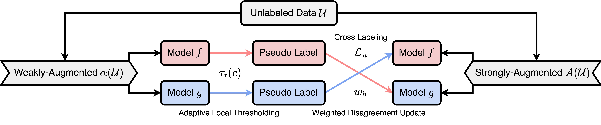

# JointMatch: A Unified Approach for Diverse and Collaborative Pseudo-Labeling to Semi-Supervised Text Classification



This repository contains the implementation of the paper:
> **JointMatch: A Unified Approach for Diverse and Collaborative Pseudo-Labeling to Semi-Supervised Text Classification** 
> [[Paper]](https://aclanthology.org/2023.emnlp-main.451.pdf) [[ACL Anthology]](https://aclanthology.org/2023.emnlp-main.451/) [[OpenReview]](https://openreview.net/forum?id=ZAHyZ3CBds) [[arXiv]](https://arxiv.org/abs/2310.14583) <br>
> Conference on Empirical Methods in Natural Language Processing (EMNLP), 2023 <br>
> Henry Peng Zou, Cornelia Caragea <br>

## News

🌱 Welcome to check out our other work on semi-supervised learning and pseudo-label debiasing: [DeCrisisMB](https://github.com/HenryPengZou/DeCrisisMB)!


## Setup
### Install Package 
```bash
conda create -n jointmatch python=3.8 -y
conda activate jointmatch

# install pytorch
conda install pytorch==1.12.1 torchvision==0.13.1 torchaudio==0.12.1 -c pytorch

# install dependency
pip install -r requirements.txt
```
### Data Preparation
The file structure should look like:

```bash
code/
  |-- criterions
  |-- models
  |-- utils
  |-- main.py
  |-- panel_main.py 
  ......
data/
  |-- ag_news
  |-- imdb
  |-- yahoo
    |-- train.csv
    |-- val.csv
    |-- test.csv
    ......
```

## Reproduce Paper Results

To reproduce our main paper results, simply run: 
```bash
python panel_main.py
```
    
Specify the dataset, output location if you need, e.g., dataset = 'ag_news' and experiment_home = './experiment'. 

To reproduce results with varying number of labeled data, simply run:
```bash
python panel_num_labels.py
```

## Custom Dataset

To customize your own datasets (generate weak and strong data augmentations), please follow the demo [`preprocess.ipynb`](https://github.com/HenryPengZou/JointMatch/blob/main/data/custom_dataset/preprocess.ipynb) in the [custom_dataset](https://github.com/HenryPengZou/JointMatch/tree/main/data/custom_dataset) folder.

## Bugs or Questions

If you have any questions related to the code or the paper, feel free to email Henry Peng Zou (pzou3@uic.edu). If you encounter any problems when using the code, or want to report a bug, you can open an issue. Please try to specify the problem with details so we can help you better and quicker!


## Citation
If you find this repository helpful, please consider citing our paper 💕: 
```bibtex
@inproceedings{zou2023jointmatch,
    title={JointMatch: A Unified Approach for Diverse and Collaborative Pseudo-Labeling to Semi-Supervised Text Classification},
    author={Zou, Henry and Caragea, Cornelia},
    booktitle={Proceedings of the 2023 Conference on Empirical Methods in Natural Language Processing},
    pages={7290--7301},
    year={2023}
}

@inproceedings{zou2023decrisismb,
    title={DeCrisisMB: Debiased Semi-Supervised Learning for Crisis Tweet Classification via Memory Bank},
    author={Zou, Henry and Zhou, Yue and Zhang, Weizhi and Caragea, Cornelia},
    booktitle={Findings of the Association for Computational Linguistics: EMNLP 2023},
    pages={6104--6115},
    year={2023}
}
```

## Acknowledgement
This repo borrows some data and codes from [SAT](https://github.com/declare-lab/SAT) and [USB](https://github.com/microsoft/Semi-supervised-learning). We appreciate their great works. <br>
Besides, welcome to check out our other work on semi-supervised learning: [DeCrisisMB](https://github.com/HenryPengZou/DeCrisisMB)!
